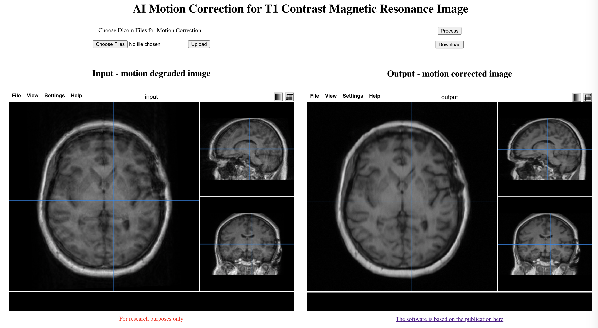

# MocoNetApp

This repository contains a browser based GUI software for the deep learning motion correction algorithm publlished in:

[Pawar K, Chen Z, Shah NJ, Egan GF. Suppressing motion artefacts in MRI using an Inception‐ResNet network with motion simulation augmentation. *NMR in Biomedicine. 2019 Dec 22:e4225.*](https://doi.org/10.1002/nbm.4225)

## Installation
clone the repository and run the setup.sh file
````
sh setup.sh
````

## Dependencies
nibabel, gevent, flask, progressbar, nibabel, pydicom, Keras, zipfile

## Run
To start GUI run
````
python runMcAPP.py
````
In web browser go to [http://127.0.0.1:5000](http://127.0.0.1:5000) (tested with Google Chrome)


This should display GUI



Click on **Choose Files** and select all the dicom files (*.dcm) for the scan, then click on **upload**, which will display the motion degraded image in the left viewer

Click on **Process** to run the AI motion correction algorithms on the input images.

Click in **Download** to save motion corrected images. (It will be a zip file containing all the processed dicom images)

The GUI uses [papya viewer](https://github.com/rii-mango/Papaya).
Explore the top right corner icons of the image viewer for image roatation and dynamic range settings. 

**Note:** If viewer shows the same image even after uploading the new images, this is because the broweser is displaying image from the cache. On macOS + google chrome, use cmd+shift+r to bypass cache or use shift+reload-click 
